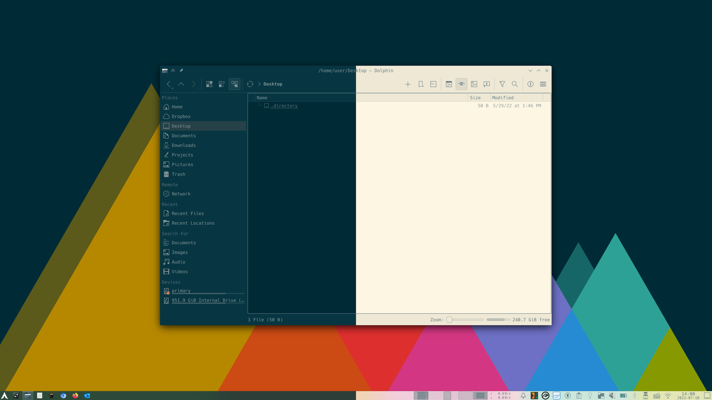

# KDE Plasma Solarized



This repository contains Solarized Dark and Light color schemes for KDE Plasma.

The color schemes are based on the official Breeze Dark and Light color schemes that come pre-installed with KDE Plasma.
I simply replaced each color with the closest equivalent from the [official Solarized color schemes](https://ethanschoonover.com/solarized/) by Ethan Schoonover.

## Installation

Simply download either the dark or light variant of the color scheme file from this repository and place it into your `~/.local/share/color-schemes/`.
You can then select the color scheme from _System Settings > Appearance > Colors_.

You can also use a tool like `wget` to download the files:

``` bash
$ wget https://raw.githubusercontent.com/ret2src/kde-plasma-solarized/main/BreezeSolarizedDark.colors -O ~/.local/share/color-schemes/BreezeSolarizedDark.colors

$ wget https://raw.githubusercontent.com/ret2src/kde-plasma-solarized/main/BreezeSolarizedLight.colors -O ~/.local/share/color-schemes/BreezeSolarizedLight.colors
```

## Accent Color

If you're using a current version of KDE Plasma, you'll have the choice to set an accent color.
For an unobtrusive look, I recommend you set it to `#657b83`, which is color `base 0` in the Solarized color scheme.
Alternatively, if you prefer less decency and some more "pop" on your desktop, set it to one of the other Solarized accent colors shown below.

### Base 0 Accent Color (#657b83)


### Yellow Accent Color (#b58900)


### Orange Accent Color (#cb4b16)


### Red Accent Color (#dc322f)


### Magenta Accent Color (#d33682)


### Violet Accent Color (#6c71c4)


### Blue Accent Color (#268bd2)


### Cyan Accent Color (#2aa198)


### Green Accent Color (#859900)


